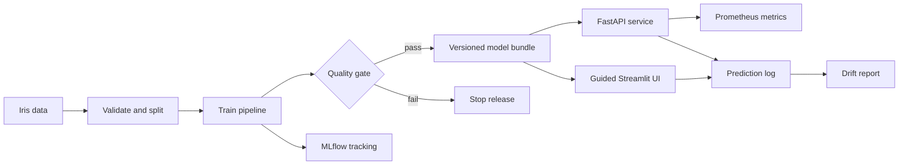

# End-to-End MLOps: Iris Classification

[](https://github.com/darren236/end-to-end-mlops/actions/workflows/ci.yml)
[](https://www.python.org/)
[](LICENSE)

A compact reference project that takes a machine-learning model from reproducible training to a monitored prediction API. It is deliberately small enough to understand in one sitting while retaining the pieces used in real MLOps systems.

> This uses the classic Iris dataset so the repository can focus on the lifecycle rather than data acquisition. It is a learning project, not a production model for a consequential decision.

## What this demonstrates

| Stage | Implementation |
|---|---|
| Data and validation | Versioned built-in Iris dataset with schema and quality checks |
| Reproducible training | Seeded scikit-learn pipeline and explicit configuration |
| Experiment tracking | Local MLflow runs with parameters, metrics, and model artifacts |
| Model quality gate | Training fails when held-out accuracy is below the threshold |
| Packaging and serving | Serializable model bundle exposed through FastAPI |
| Guided interface | Streamlit walkthrough from dataset to prediction and drift result |
| Observability | Prometheus request metrics and structured prediction logs |
| Drift detection | Feature-mean shift compared with the training baseline |
| Delivery | Tests, linting, model training, and Docker build in GitHub Actions |



## Quick start

Python 3.11–3.13 is supported.

```bash
python3.12 -m venv .venv
source .venv/bin/activate
python -m pip install -e ".[dev]"

make train
make test
make serve
```

Open the interactive API documentation at [http://localhost:8000/docs](http://localhost:8000/docs).

Send a prediction:

```bash
curl -X POST http://localhost:8000/predict \
  -H "Content-Type: application/json" \
  -d @examples/sample_request.json
```

Example response:

```json
{
  "predicted_class": "setosa",
  "class_probabilities": {
    "setosa": 0.98,
    "versicolor": 0.02,
    "virginica": 0.0
  },
  "model_version": "0.2.0"
}
```

## Guided user interface

Run the interactive walkthrough:

```bash
make ui
```

Open [http://localhost:8501](http://localhost:8501) and move through five stages:

1. Explore the validated dataset and class balance.
2. Configure and run a tracked training pipeline.
3. Review cross-validation, held-out metrics, and the confusion matrix.
4. Adjust measurements and inspect the model's probability distribution.
5. Simulate feature drift or analyze predictions made in the interface.

The interface is educational and uses the same model bundle, monitoring calculation, and prediction-event schema as the API.

## Inspect experiments

Training writes the MLflow database and tracked artifacts to `./mlruns`, and the approved release artifact to `./artifacts`.

```bash
mlflow ui --backend-store-uri sqlite:///mlruns/mlflow.db
```

Then visit [http://localhost:5000](http://localhost:5000).

## Monitor the service

Prometheus-compatible runtime metrics are available at:

```text
GET http://localhost:8000/metrics
```

Predictions are appended to `logs/predictions.jsonl`. Generate a drift report after making a few requests:

```bash
make monitor
```

The report compares live feature means with the training distribution in standard-deviation units. This transparent check is suitable for a demo; production systems should use larger windows, robust statistical tests, and alert routing.

## Run with Docker

The multi-stage image trains and validates the model during the build, then copies only the approved model into the runtime image.

```bash
docker build -t mlops-iris-demo .
docker run --rm -p 8000:8000 mlops-iris-demo
```

Or start both the API and guided interface:

```bash
docker compose up --build
```

The API is available on port `8000` and the walkthrough on port `8501`.

## Repository layout

```text
.
├── .github/workflows/ci.yml  # Continuous integration pipeline
├── examples/                 # Sample API input
├── src/mlops_demo/
│   ├── api.py                # Prediction API and Prometheus metrics
│   ├── data.py               # Data loading and validation
│   ├── model.py              # Portable model bundle
│   ├── monitor.py            # Drift calculation and report CLI
│   ├── train.py              # Training, evaluation, gate, and MLflow logging
│   ├── telemetry.py          # Shared prediction-event persistence
│   ├── ui.py                 # Five-stage Streamlit walkthrough
│   └── ui_support.py         # Testable interface calculations
├── tests/                    # Unit and integration tests
├── compose.yaml              # API and interface services
├── Dockerfile                # Training, API, and interface image stages
├── Makefile                  # Common developer commands
└── pyproject.toml            # Package and tool configuration
```

## Quality gate

The default held-out accuracy threshold is `0.90`. Override it to test failure behavior:

```bash
python -m mlops_demo.train --accuracy-threshold 0.99
```

The run and its metrics are still recorded in MLflow, but no release artifact is produced when the gate fails.

## Next production steps

- Replace the local MLflow file store with a shared tracking server and object storage.
- Version external datasets and features rather than relying on a packaged dataset.
- Sign and scan the container image, then deploy it through a protected environment.
- Send prediction logs and Prometheus metrics to managed observability backends.
- Add authentication, rate limiting, canary releases, and automated rollback criteria.

## License

[MIT](LICENSE)
